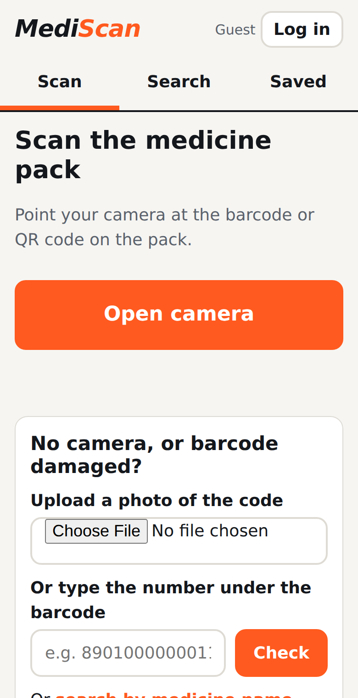
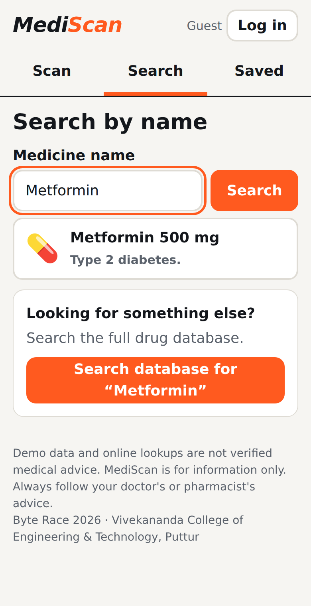
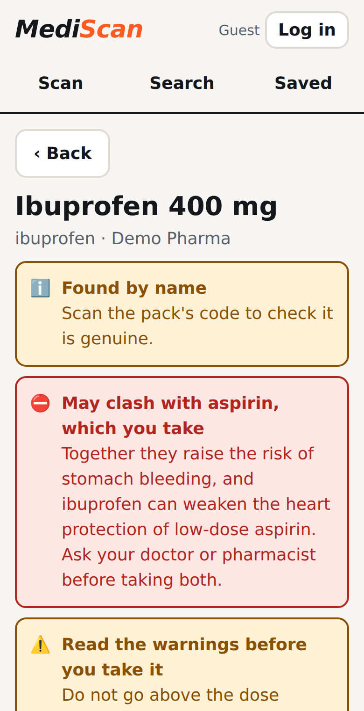
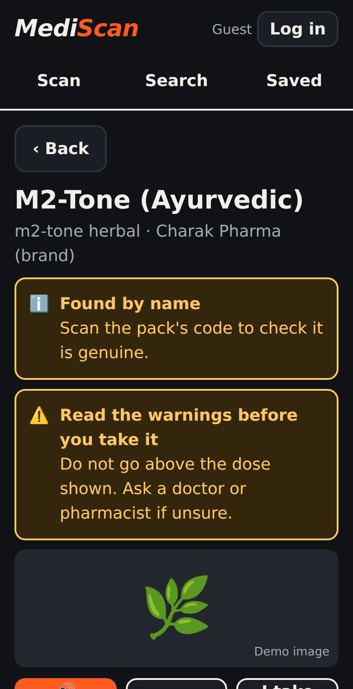
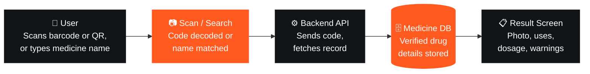
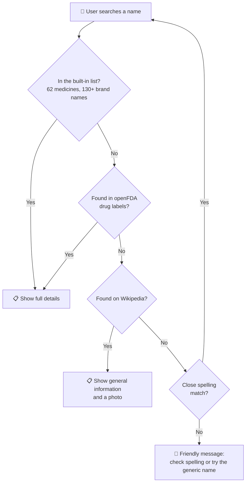
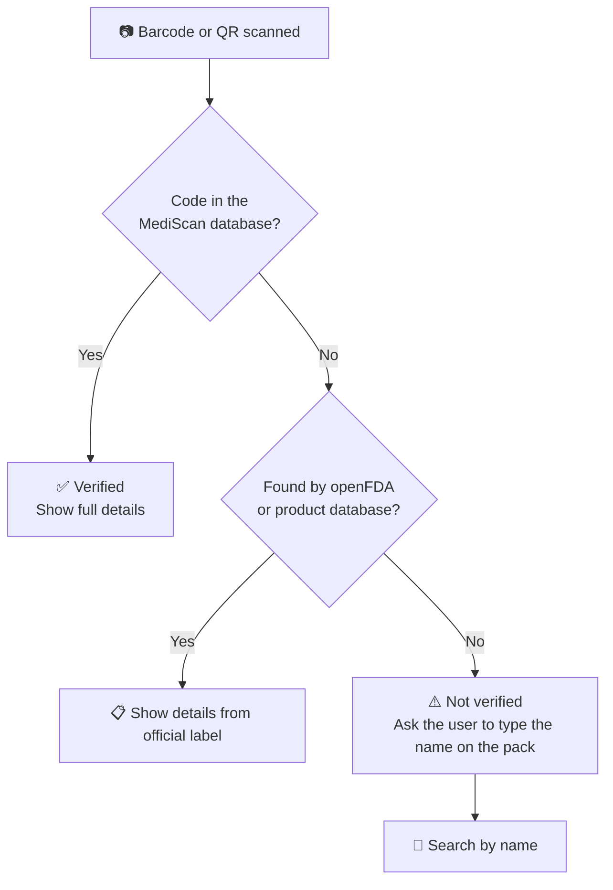
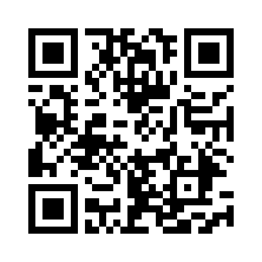

<div align="center">

# 💊 MediScan

### *Scan any medicine, know everything.*

**A smart medicine-information app that lets users scan or search a medicine and instantly get its uses, dosage, side effects and safety warnings in simple language.**

[](https://vaishnavi-g-bhat.github.io/Mediscan1/)
[](#-team)
[](#-implementation-progress)


**Byte Race 2026 · Project Sprint · Idea Submission**
*Where ideas race to reality*

</div>

---

## 📑 Table of Contents

- [🎯 The Problem](#-the-problem)
- [💡 Our Solution](#-our-solution)
- [🏁 Objectives](#-objectives)
- [✨ Features](#-features)
- [📱 Screenshots](#-screenshots)
- [🔄 How It Works](#-how-it-works)
- [🧱 Tech Stack](#-tech-stack)
- [🗄️ Medicine Data](#️-medicine-data)
- [🚀 Try It Now](#-try-it-now)
- [🛠️ Run It Yourself](#️-run-it-yourself)
- [➕ Add More Medicines](#-add-more-medicines)
- [📊 Implementation Progress](#-implementation-progress)
- [🌍 Impact and Future Scope](#-impact-and-future-scope)
- [⚠️ Challenges and How We Handle Them](#️-challenges-and-how-we-handle-them)
- [📂 Project Structure](#-project-structure)
- [🙏 Credits](#-credits)
- [🩺 Disclaimer](#-disclaimer)
- [👥 Team](#-team)

---

## 🎯 The Problem

Patients often cannot find clear, trusted information about their medicines.

| | |
|---|---|
| 🔍 **Tiny print** | Labels have small text and complicated medical jargon |
| 📄 **Lost leaflets** | Information leaflets get lost or thrown away |
| 🌐 **Mixed answers** | Online search gives confusing, sometimes unreliable results |
| ⚠️ **Real danger** | Wrong dosage, missed warnings about side effects and interactions, and use of fake or expired medicines |

### 👥 Who is affected?
Patients, elderly people, caregivers and families, especially people buying medicines without a doctor's guidance.

### ❗ Why does it matter?
Wrong medicine use causes **preventable harm, hospital visits and loss of trust in medicines**.

### 🕳️ What is missing today?
A fast, simple way to see full, verified details of a medicine **from the pack itself**.

---

## 💡 Our Solution

> **MediScan: scan a medicine pack or search its name to instantly see photo, uses, side effects and dosage.**

| 01 · Scan or search | 02 · Complete details | 03 · Safety alerts |
|---|---|---|
| Use the barcode, QR code or the medicine name | Photo, uses, effects, side effects, dosage and storage | Interactions, expiry and fake-medicine check |

### ⭐ What makes it unique
**One scan gives everything in simple language, with voice read-out and local language support, and saved results work offline.**

---

## 🏁 Objectives

| # | Objective |
|:-:|---|
| **01** | Let users scan a barcode or QR code, or type a medicine name, and get full details in seconds. |
| **02** | Show photo, uses, effects, side effects and dosage in simple, easy-to-read language. |
| **03** | Warn users about interactions, expiry and unsafe use before they take a medicine. |
| **04** | Support local languages and voice read-out so elders can use it easily. |

---

## ✨ Features

### 📷 Scan
- Scan a **barcode or QR code** with the phone camera, directly in the browser
- **No camera?** Upload a photo of the code instead
- **Barcode damaged?** Type the number under the barcode, or search by name
- Built-in demo codes so the scanner can be tried without a real pack

### 🔎 Search
- Search by **brand name or generic name**, with live suggestions as you type
- Understands **130+ common brand names (mostly Indian)**, for example Dolo 650, Crocin, Combiflam, Augmentin, Pan 40 and Thyronorm
- **Spelling mistakes are tolerated**, for example *paracetmol* still finds paracetamol
- Can also search by problem, for example *fever*

### 📋 Complete medicine details
- 💊 Photo (built-in list shows an icon, online results show a photo where one exists)
- **Uses**, **Dosage**, **Side effects**, **Warnings**, **Interactions**, **Storage**
- Written in **plain language** for patients and caregivers

### 🛡️ Safety alerts
| Alert | What it does |
|---|---|
| ✅ **Verified** | The scanned code matches a medicine in the MediScan database |
| ⚠️ **Not verified** | The code is not in the database, so the pack may be unverified or fake |
| ⏳ **Expiry check** | Enter the expiry date from the pack and get **Expired** (red), **Expiring soon** (amber, within 30 days) or **Not expired** (green) |
| ⛔ **Interaction warning** | Add the medicines you take to **My medicines**. MediScan warns you if a new medicine may clash with them |
| 📌 **Unsafe-use reminder** | A warning before the dosage section: do not exceed the stated dose and ask a doctor or pharmacist if unsure |

Every alert uses **colour + icon + words**, never colour alone.

### 🔊 Made for elders
- **Listen** button reads the whole result aloud (voice read-out)
- Large text, big buttons, high contrast and simple words
- Automatic **dark mode** that follows the phone setting

### 🔐 Login is optional
- The app **opens straight away** as a guest. Scan and search work without any login
- Sign up or log in only if you want your own saved list. A demo account is provided
- Saved medicines and "My medicines" are kept on the device and open without internet

---

## 📱 Screenshots

<div align="center">

| Scan | Search | Result with alert | Dark mode |
|:-:|:-:|:-:|:-:|
|  |  |  |  |

</div>

---

## 🔄 How It Works



> **Flow:** Scan or search by name, identify the medicine, fetch verified data, show results. Saved results can be viewed offline.

### 🔎 How the web prototype finds a medicine





---

## 🧱 Tech Stack

### 📐 Planned stack (full mobile app)

| Component | Technology |
|---|---|
| **Frontend** | Flutter or React Native for Android and iOS |
| **Backend** | Node.js REST API for lookup by code or name |
| **Database & Storage** | PostgreSQL medicine database (name, uses, dosage, side effects, images) |
| **AI / ML / APIs** | Google ML Kit for barcode and QR scanning; open drug data sources |
| **Hardware / IoT** | Smartphone camera only. No extra hardware needed |
| **Tools & AI assistants used** | GitHub, Figma, Postman, Firebase for hosting |

### 🌐 What this repository contains (web prototype)

This website is the **web prototype of the planned mobile app**. It proves the idea end to end and can be tried by anyone with a phone browser.

| Part | Used in the prototype |
|---|---|
| App | Single-page site in plain **HTML, CSS and JavaScript** (no build step) |
| Scanning | [`html5-qrcode`](https://github.com/mebjas/html5-qrcode) using the browser camera |
| Voice read-out | Browser **Web Speech API** |
| Storage | Browser local storage (saved medicines, My medicines, optional accounts) |
| Drug data | Built-in database plus **openFDA** drug labels |
| Extra lookups | **Wikipedia** (description and photo) and an open product database (barcode to product name) |
| Hosting | **GitHub Pages** |
| Font | Atkinson Hyperlegible, designed for easy reading |

---

## 🗄️ Medicine Data

| Source | What it gives | When it is used |
|---|---|---|
| 📚 **Built-in database** | **62 common medicines** with uses, dosage, side effects, warnings, interactions and storage. Works with **no internet** | First, always |
| 🏷️ **Brand name list** | **130+ brand names (mostly Indian)** mapped to their generic name | Before every search |
| 🇺🇸 **openFDA** | Official drug-label text for thousands of medicines | When a name is not in the built-in list |
| 📖 **Wikipedia** | General description and a photo | When openFDA has nothing |
| 🏪 **Open product database** | Product name from a scanned barcode | When a scanned code is unknown |

**Built-in medicines include:** paracetamol, ibuprofen, aspirin, cetirizine, omeprazole, pantoprazole, metformin, amlodipine, atorvastatin, azithromycin, amoxicillin, levothyroxine, ORS, loperamide, diclofenac, vitamin C and D3, M2-Tone (Ayurvedic) and many more.

**Interaction rules cover:** pain-killer combinations (NSAIDs), bleeding-risk combinations (aspirin, clopidogrel, warfarin), thyroid medicine with calcium or iron, ciprofloxacin with calcium, clopidogrel with omeprazole, steroids with pain-killers, and blood-pressure or water tablets with pain-killers.

---

## 🚀 Try It Now

### 🌐 Open the live demo
**👉 https://vaishnavi-g-bhat.github.io/Mediscan1/**

<div align="center">



*Scan with your phone to open MediScan*

</div>

### 🔑 Login
No login is needed. Tap **Continue without login**, or use the demo account:

| Username | Password |
|---|---|
| `demo` | `demo123` |

### 📷 Test the scanner without a real pack
Open the **Scan** tab and tap a demo code, or type one of these in the number box. Scanning a printed or on-screen QR code of the same number also works.

| Code | Medicine |
|---|---|
| `8901000000011` | Paracetamol 500 mg |
| `8901000000028` | Ibuprofen 400 mg |
| `8901000000035` | Aspirin 75 mg |
| `8901000000042` | Cetirizine 10 mg |
| `8901000000059` | Omeprazole 20 mg |
| `8901000000066` | ORS powder |
| `8901000000073` | Loperamide 2 mg |
| `8901000000080` | Diclofenac 50 mg |
| `8901000000097` | M2-Tone (Ayurvedic) |
| `0000000000000` | *Unknown code, shows the Not verified warning* |

### ✅ Quick test checklist
- [ ] Search **Dolo 650** and open the result
- [ ] Search **paracetmol** (spelling mistake) and see it still works
- [ ] Open **Aspirin**, tap **I take this**, then open **Ibuprofen** and see the red interaction warning
- [ ] Enter an old date in **Expiry date on the pack** and see the **Expired** alert
- [ ] Tap **Listen** to hear the result read aloud
- [ ] Tap **Save**, then open the **Saved** tab
- [ ] Try the unknown code `0000000000000` to see **Not verified**

---

## 🛠️ Run It Yourself

The whole app is one file, so there is nothing to install.

**Option 1: Open it**
1. Download or clone this repository
2. Open `index.html` in a browser

**Option 2: Run a local server (recommended, camera needs `localhost` or HTTPS)**
```bash
git clone https://github.com/vaishnavi-g-bhat/Mediscan1.git
cd Mediscan1
python -m http.server 8000
```
Then open `http://localhost:8000`.

**Option 3: Host it on GitHub Pages**
1. Push `index.html` to the `main` branch
2. Go to **Settings → Pages**
3. Under **Source**, choose the `main` branch and the root folder, then save
4. After a minute your site is live at `https://<your-username>.github.io/<repository-name>/`

> 📸 The camera only works on **HTTPS** or **localhost**. GitHub Pages is HTTPS, so scanning works on phones.

---

## ➕ Add More Medicines

Medicines in the built-in list are stored as one line each in `index.html`, inside the block named `MORE`. Each line has seven parts separated by `|`:

```
Name | generic name | brand names | uses | dosage | side effects | warnings
```

Example:

```
Cetirizine 10 mg|cetirizine|Cetzine, Okacet|Allergy relief.|Adults: 1 tablet once a day.|Sleepiness, dry mouth.|May cause drowsiness. Do not drive if sleepy.
```

Brand names are added to the search automatically. Interaction rules are in the `GROUPS` and `PAIRS` lists next to it. **Always check new entries against a trusted source before using them.**

---

## 📊 Implementation Progress

| ✅ Completed | 🔄 In Progress | 🗓️ Planned / Next |
|---|---|---|
| Problem research done | UI screens design | Full app build and testing |
| Feature list finalised | Scanner and name search | Add voice and local languages |
| App flow and architecture designed | Medicine database setup | Pharmacy and doctor pilot |
| Web prototype published online | Hindi and Kannada language support | Android and iOS mobile app |
| Built-in list of 60+ common medicines | Medicine photos and verified data sources | Testing with elders and caregivers |
| Expiry, interaction and Not verified alerts | Matching Indian pack barcodes to medicines | Regular database updates |
| Voice read-out button for elders | | |

---

## 🌍 Impact and Future Scope

### 💚 Impact
- Safer medicine use, fewer dosage mistakes and better awareness for patients and caregivers
- Fewer wrong-dose and wrong-medicine errors
- Elders can **listen instead of reading** tiny print
- Caregivers can check a pack in seconds

### 📈 Feasibility and scalability
- Works on any smartphone with a camera
- The web version needs **no app install**
- The database can grow to cover more medicines and regions, just by adding records
- Free hosting keeps the running cost close to zero

### 🔭 Future scope
- 🔗 **Prescription linking**
- 🏥 **Pharmacy integration** and nearby pharmacy and doctor lookup
- 🌐 **Support for more languages** (Hindi, Kannada and more)
- ⏰ Medicine timing reminders
- 👨‍👩‍👧 Family profiles for caregivers
- 📱 Native Android and iOS app

---

## ⚠️ Challenges and How We Handle Them

| Challenge | Our approach |
|---|---|
| **Getting verified, up-to-date data** | Use trusted sources and regular updates |
| **Damaged or missing barcodes** | Users can search by medicine name instead |
| **Indian pack barcodes are not in free public databases** | Ask the user to type the name printed on the pack, then show details. A local database is planned |
| **Online drug labels use technical language** | Text is shortened, and the built-in entries are written in simple words |
| **Information must never replace medical advice** | A disclaimer is shown on every result |

---

## 📂 Project Structure

```
Mediscan1/
├── index.html          # The complete MediScan web app
├── README.md           # This file
└── assets/
    ├── demo-qr.png            # QR code of the live demo
    ├── screenshot-scan.png    # Scan screen
    ├── screenshot-search.png  # Search screen
    ├── screenshot-result.png  # Result with interaction warning
    └── screenshot-dark.png    # Dark mode result
```

---

## 🙏 Credits

- [openFDA](https://open.fda.gov/) for open drug-label data
- [Wikipedia](https://www.wikipedia.org/) for general medicine descriptions and photos
- [html5-qrcode](https://github.com/mebjas/html5-qrcode) for browser barcode and QR scanning
- [Atkinson Hyperlegible](https://fonts.google.com/specimen/Atkinson+Hyperlegible) font by the Braille Institute
- [GitHub Pages](https://pages.github.com/) for free hosting

---

## 🩺 Disclaimer

> **MediScan is for information only. Always follow your doctor's or pharmacist's advice.**
>
> The built-in medicine list is **demo data written in simple language for this prototype**, and online results come from public sources. Neither is a replacement for professional medical advice, diagnosis or treatment. Never start, stop or change a medicine because of what this app shows. If a pack looks suspicious, take it to a pharmacist.

---

## 👥 Team

**Team name:** `FourMinds`

| # | Member name | USN |
|:-:|---|---|
| 1 | Sanvi P (Team Leader) |4VP25CS084 |
| 2 | Vaishnavi G Bhat | 4VP25CS110  |
| 3 | Shravya NP | 4VP25CS088 |
| 4 | Shreya K.R | 4VP25CS092 |

**Contact:** `Sanvi P` | `sanvip611@gmail.com` | `7019085164`

### 🏫 College
**Vivekananda College of Engineering and Technology**
Nehru Nagar, Puttur – 574203
Department of Computer Science & Engineering · ACES

<div align="center">

---

**Byte Race 2026 · Where ideas race to reality**

*If MediScan helps even one person take a medicine safely, it has done its job.* 💊

</div>
